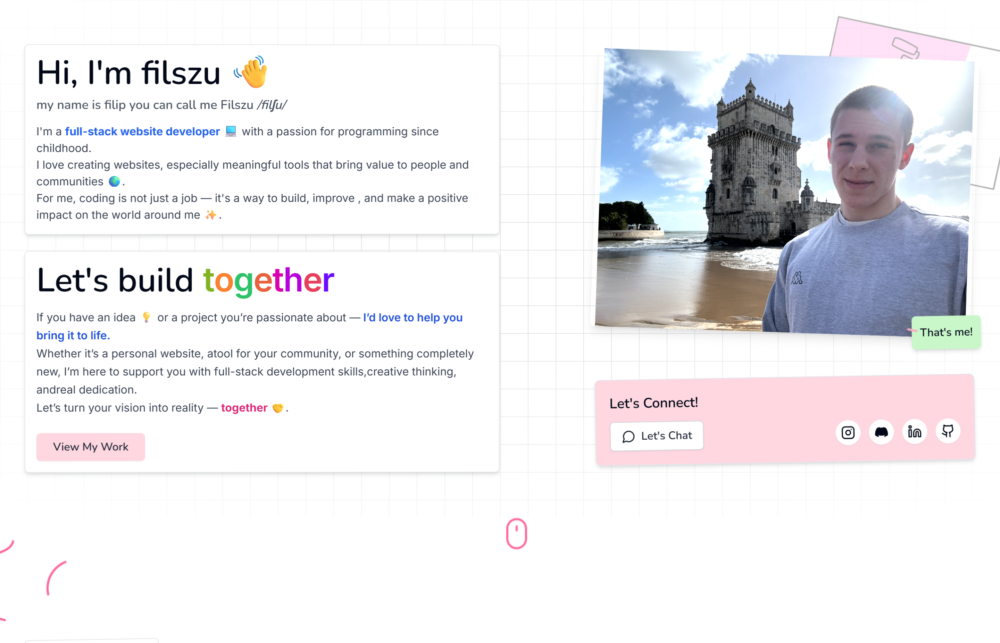

# 📝 Filip Szumowski Portfolio

An interactive, notebook-style portfolio website showcasing my projects and skills as a full-stack web developer.

## 🚀 [View Live Demo](https://filszu.vercel.app/)

## ✨ Features

- 📱 Responsive design that works on all devices
- 🎨 Playful notebook-style UI with animations
- 📂 Showcase of featured projects with detailed descriptions
- 🏷️ Project filtering by technology
- 🖼️ Interactive image galleries
- 📊 Visual representation of tech stack
- 📱 Progressive Web App (PWA) support
- 🌙 Light/dark mode support (coming soon)

## 🛠️ Built With

- **Next.js** - React framework for server-side rendering and static site generation
- **TypeScript** - For type safety and better developer experience
- **Tailwind CSS** - For utility-first styling
- **Framer Motion** - For smooth animations and transitions
- **Shadcn UI** - For accessible and customizable UI components
- **Lottie** - For lightweight animations

## 🧰 Project Structure

- `app/` - Next.js App Router pages and layouts
- `components/` - Reusable React components
- `data/` - JSON data for projects and other content
- `public/` - Static assets like images and icons
- `lib/` - Utility functions and helpers

## 📋 Projects Featured

- PartyVote - Interactive music voting system
- OSIR Bunkier - Commercial website for a recreation center
- Kaizen Steps - Habit tracking application
- Boxing Timer - Professional boxing training timer
- And many more!

## 🚀 Getting Started

### Prerequisites

- Node.js (v18 or higher)
- npm or yarn

### Installation

1. Clone the repository:
   \`\`\`bash
   git clone https://github.com/Filszu/portfolio.git
   cd portfolio
   \`\`\`

2. Install dependencies:
   \`\`\`bash
   npm install
   # or
   yarn install
   \`\`\`

3. Run the development server:
   \`\`\`bash
   npm run dev
   # or
   yarn dev
   \`\`\`

4. Open [http://localhost:3000](http://localhost:3000) in your browser to see the result.

## 🤝 Contributing

Contributions, issues, and feature requests are welcome! Feel free to check the [issues page](https://github.com/Filszu/portfolio/issues).

## 📝 License

This project is [MIT](LICENSE) licensed.

## 👨‍💻 Author

**Filip Szumowski**

- GitHub: [@Filszu](https://github.com/Filszu)
- Website: [filszu.vercel.app](https://filszu.vercel.app)

---

⭐️ If you like this project, please consider giving it a star on GitHub! ⭐️
